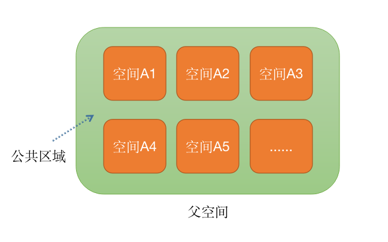

## 功能概述

### 关于涂鸦商照

涂鸦商用照明解决方案是一套完整的物联网控制系统，适用于新装和存量的商用照明市场，为其提供从设备端到软件控制端以及施工端的一套完整方案服务。通过设备管理、能源管控、人因照明等实现绿色建筑与健康建筑。

涂鸦商用照明解决方案为客户后期的产品维护与运营提供数字化、可视化的管理平台，帮助客户实现商业智能化，降低管理成本。

涂鸦商用照明解决方案的六大核心优势：

- 低成本的即开即用方案
- 丰富的物联能力
- 快速增长的强大生态系统
- 可持续的增值服务
- 数字化全球项目运营管理
- 金融级网络数据安全

### 关于涂鸦商照SDK

Tuya Smart Commercial Lighting SDK是一套针对商用照明领域开发的Android端解决方案，Android开发者可以基于SDK快速实现商用照明及关联场景的App功能开发，实现对项目、空间以及设备的管理和控制等操作。

SDK主要包括以下功能：

- 用户体系
  - 用户的登录、注册等操作
  - 支持手机号码和邮箱等账号体系
  - 支持修改密码、账号注销等操作
  - 支持更新用户相关信息如昵称等
  - 支持用户权限分配
- 项目管理
  - 支持项目的创建、更新、修改、查询等操作
  - 支持获取项目详情
- 空间管理
  - 支持空间的增加、删除、修改、查询等操作
  - 支持空间群控
  - 支持获取项目下一级空间列表和空间下自层级空间列表
  - 支持项目维度的空间层级的动态配置
  - 获取空间下设备列表
- 设备配网
  - 支持EZ、AP等配网模式
  - 支持Sigmesh、Zigbee、WIFI等多种协议设备配网
- 设备管理
  - 支持设备单控和网关类子设备控制
  - 设备信息变更，如设备名称等
  - 设备移除功能
  - 设备信息查询功能

### 名词解释

- 账号
  - 用户通过手机号码、邮箱注册并登陆后，即可成为商照体系的一个账号。
- 项目
  - 项目为挂载在某一账号下的可独立操作的【单元】，空间和设备等必须要挂载在某一项目下才可进行操作。
  - 一个账号下可以有不定数量的项目，新用户在注册登录后默认是没有项目的，需进行项目的创建流程后才可进行项目维度的相关操作。
- 空间
  - 空间是挂载在某一项目下的可独立操作的【单元】。
  - 空间可以有不定数量的子空间。
  - 最小层级的空间无法创建子空间。
  - 空间下可以挂载不定数量的设备或群组等。
- 未分区
  - 未分区是挂载在项目下的一种特殊空间类型，是一直存在且一定存在的空间类型。
  - 未分区只会在一级空间列表中存在，在子空间列表中不会出现。
  - 特定情况下，如设备配网后，未加入到指定空间下时，设备会默认存放在【未分区】空间下。
  - 删除某一空间时，该空间下的设备不会被删除，而是会被转移到【未分区】空间下。
- 公共区域
  - 公共区域是挂载在某一空间下的特殊子空间，一个空间下最多只存在一个（也可能是不存在）公共区域。
  - 公共区域是非人为创建的特殊空间类型，会在特定情况下产生或消失。
  - 公共区域可以理解为父空间去除人为创建的子空间后的【共享】区域，为父空间与子空间的【差集】区域。

账号-项目-空间三者的关系如图所示：

空间-子空间-公共空间关系如图所示：

