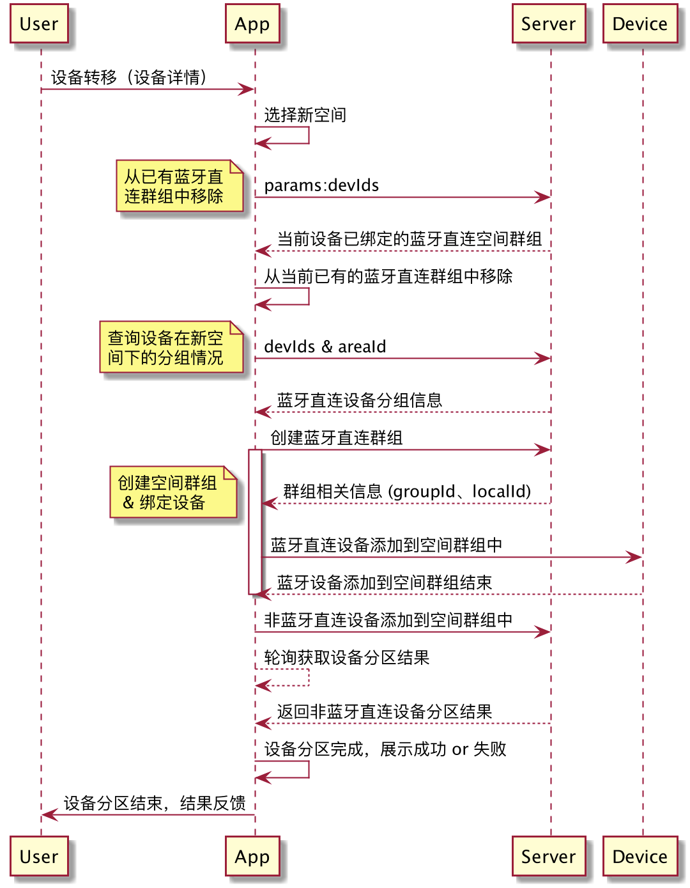

# 空间管理

#### 获取一级空间列表

```
TuyaCommercialLightingSdk.newProjectInstance(projectId).getAreaList(
			new ITuyaResultCallback<List<AreaBean>>() {
            @Override
            public void onSuccess(List<AreaBean> result) {
            }

            @Override
            public void onError(String errorCode, String errorMessage) {
            }
        });
```

##### 参数说明：

| 参数  | 说明   |
| ----- | ------ |
| projectId | 项目ID |

#### 获取子空间列表

```
TuyaCommercialLightingSdk.newAreaInstance(long projectId, long areaId).getSubAreaList(
    ITuyaResultCallback<List<AreaBean>> listener
);
```

##### 参数说明：

| 参数  | 说明   |
| ----- | ------ |
| projectId | 项目ID |
| areaId | 空间ID |


#### 获取空间层级列表

获取项目下的一级层级列表
```
TuyaCommercialLightingSdk.newProjectInstance(long projectId).getAreaLevels(
    boolean needUnassignedArea,
    boolean needPublicArea,
    ITuyaResultCallback<AreaListInProjectResponse> callback
) ;
```
##### 参数说明：

| 参数  | 说明   |
| ----- | ------ |
| projectId | 项目ID |
| needUnassignedArea | 是否返回未分区层级 |
| needPublicArea | 是否返回公共区域层级 |

#### 获取空间信息
```
TuyaCommercialLightingSdk.newAreaInstance(long projectId, long areaId).getAreaInfo(
    ITuyaResultCallback<SimpleAreaBean> callback
);
```
##### 参数说明：

| 参数  | 说明   |
| ----- | ------ |
| projectId | 项目ID |
| areaId | 空间ID |


#### 创建空间

```
TuyaCommercialLightingSdk.getLightingAreaManager().createArea(
    long projectId,
    long currentAreaId,
    String name,
    int roomLevel,
    ITuyaResultCallback<SimpleAreaBean> callback
 );
```

##### 参数说明：

| 参数  | 说明   |
| ----- | ------ |
| projectId | 项目ID |
| currentAreaId | 当前空间ID，若无传 0 |
| name | 空间名称 |
| roomLevel | 创建的空间层级ID |

#### 创建子空间

```
TuyaCommercialLightingSdk.newAreaInstance(long projectId, long areaId).createSubArea(
    String subAreaName,
    ITuyaResultCallback<SimpleAreaBean> callback
);
```

##### 参数说明：

| 参数  | 说明   |
| ----- | ------ |
| projectId | 项目ID |
| areaId | 空间ID |
| subAreaName | 子空间名称 |

#### 创建父空间

```
TuyaCommercialLightingSdk.newAreaInstance(long projectId, long areaId).createParentArea(
    String parentAreaName,
    ITuyaResultCallback<SimpleAreaBean> callback
);
```

##### 参数说明：

| 参数  | 说明   |
| ----- | ------ |
| projectId | 项目ID |
| areaId | 空间ID |
| parentAreaName | 父空间名称 |

#### 修改空间

```
TuyaCommercialLightingSdk.newAreaInstance(long projectId, long areaId).updateName(
    String name,
    ITuyaResultCallback<Boolean> callback
);
```

##### 参数说明：

| 参数  | 说明   |
| ----- | ------ |
| projectId | 项目ID |
| areaId | 空间ID |
| name | 空间名称 |

#### 删除空间

```
TuyaCommercialLightingSdk.newAreaInstance(long projectId, long areaId).delete(
    ITuyaResultCallback<Boolean> callback
);
```

##### 参数说明：

| 参数  | 说明   |
| ----- | ------ |
| projectId | 项目ID |
| areaId | 空间ID |

#### 设备转移

设备转移是指将部分设备从一个空间转移到另外一个空间的操作，设备转移过程较复杂，下图为设备转移的大致流程：



**接口描述**

```
ILightingArea # transferDevices(List<String> devIds,DefaultDeviceTransferListener transferListener)
```

**参数说明**

| 参数             | 说明                   |
| ---------------- | ---------------------- |
| devIds           | 设备ID集合             |
| transferListener | 空间转移过程及结果回调 |

其中，**DefaultDeviceTransferListener**回调各方法说明如下：

```

public abstract class DefaultDeviceTransferListener implements IDeviceTransferListener {

    @Override
    public void onFilterMeshDeviceFail(String errorMsg, String errorCode) {
    		//过滤mesh设备失败回调
    }

    @Override
    public void removeDeviceFromGroupByLocalError(long groupId, List<String> devIds, String errorMsg, String errorCode) {
    		//将设备从本地群组中移除操作失败
    }

    @Override
    public void removeDeviceFromGroupByCloudError(long groupId, List<String> devIds, String errorMsg, String errorCode) {
    		//将设备从云端群组中移除失败
    }

    @Override
    public void saveDevicesToNewAreaError(long areaId, List<String> devIds, String errorMsg, String errorCode) {
    		//将设备分配到新空间下操作失败
    }

    @Override
    public void createNewGroupError(long areaId, List<String> devIds, String errorMsg, String errorCode) {
   			//创建新群组失败
   }

    @Override
    public void bindDeviceToGroupByLocalError(long groupId, String devId, String errorMsg, String errorCode) {
    		//本地将mesh设备绑定到群组中操作失败
    }

    @Override
    public void bindDeviceToGroupByGroupError(long groupId, List<String> devId, String errorMsg, String errorCode) {
    		//云端将设备绑定到群组中操作失败
    }

    @Override
    public void onTransferStateChanged(@TransferState int state) {
    		//无须关注
    }

    @Override
    public void onDeviceOperationByLocal(@TransferState int state, @DeviceOperationType int operationType,
                                         List<ComplexDeviceBean> deviceBeans, boolean success) {
        //无须关注
    }

    @Override
    public void onResult(List<FilterGroup> filterGroups) {
    		//过时的结果回调，请勿使用，可使用handleResult回调
    }

		//最终结果回调，流程结束后会走到该回调
    @Override
    public abstract void handleResult(TransferResultSummary transferResultSummary);
    

		//异常回调，走到该回调表示设备转移操作出现异常，此时不会触发handleResult回调
    @Override
    public abstract void onError(String errorMsg, String errorCode);
}

```


#### 空间群控

空间群控是指对该空间下的设备进行总控的一种功能，目前支持的空间总控功能为`开关`、`亮度`、`模式`、`色温`等，**该部分功能必须在TuyaCommercialLightingSdk#newAreaInstance#getSubAreaList接口调用后获取当前空间的AreaBean信息后再进行！**

- 获取空间群控管理类

  ```
  TuyaCommercialLightingSdk # newAreaInstance() # getLightingStandardAreaDpsManagerInstance()
  ```

- 获取该空间相关DP点数据

  - 获取DP字符串

    ```
    ILightingStandardAreaDpsManager # getDps()
    ```

  - 获取空间开关状态

    ```
    ILightingStandardAreaDpsManager # getSwitchStatus()
    ```

  - 获取亮度百分比

    ```
    ILightingStandardAreaDpsManager # getBrightPercent()
    ```

  - 获取色温百分比

    ```
    ILightingStandardAreaDpsManager # getTemperaturePercent()
    ```

  - 获取彩光模式颜色值

    ```
    ILightingStandardAreaDpsManager # String getColorData();
    ```

  - 获取场景模式

    ```
    ILightingStandardAreaDpsManager # LightDefaultSceneType getSceneStatus();
    ```

  - 获取当前灯光模式

    ```
    ILightingStandardAreaDpsManager # AreaDpMode getCurrentMode();
    ```

- 切换开关状态

  ```
  ILightingStandardAreaDpsManager # requestSwitchStatus(boolean status, final IResultCallback callback);
  ```

  **参数说明**

  | 参数     | 说明                              |
  | -------- | --------------------------------- |
  | status   | 开关状态，true：开启  false：关闭 |
  | callback | 执行结果回调                      |

- 切换灯光模式

  当前支持三种灯光模式，分别为白光模式、彩光模式和场景模式，分别对应AreaDpMode枚举中的*MODE_WHITE_LIGHT*、*MDOE_COLORFUL_LIGHT*和*MODE_SCENE*。

  **接口说明**

  ```
  ILightingStandardAreaDpsManager # requestMode(AreaDpMode mode, IResultCallback callback);
  ```

  **参数说明**

  | 参数     | 说明                                                         |
  | -------- | ------------------------------------------------------------ |
  | Mode     | 要切换的模式的枚举值，包含*MODE_WHITE_LIGHT*、*MDOE_COLORFUL_LIGHT*和*MODE_SCENE* |
  | callback | 执行结果回调                                                 |

- 调整色温值

  **该操作仅支持在白光模式下进行。**

  **接口说明**

  ```
  ILightingStandardAreaDpsManager # requestTemperaturePercent(int value, IResultCallback callback);
  ```

  **参数说明**

  | 参数     | 说明                   |
  | -------- | ---------------------- |
  | value    | 色温值，取值范围0-1000 |
  | callback | 执行结果回调           |

- 设置场景

  **该操作仅支持在场景模式下进行。**

  **接口说明**

  ```
  ILightingStandardAreaDpsManager # requestSceneStatus(LightDefaultSceneType type, IResultCallback callback);
  ```

  **参数说明**

  | 参数     | 说明                                                         |
  | -------- | ------------------------------------------------------------ |
  | type     | 场景类型，包含*NONE*、*WORK*、*MEETING*、*SIESTA*、*OFF_DUTY*，分表表示取消场景灯光、会议模式灯光、午休模式灯光和下班模式灯光。 |
  | callback | 执行结果回调                                                 |

- 设置彩光

  **该操作仅支持在彩光模式下进行。**

  通过*getColorData*获取到彩光模式的数据，该数据为12位的组合数据，组合的规则为*hhhhssssvvvv*，其中hhhh表示16进制后的色调值，ssss表示16进制后的饱和度值，vvvv表示16进制后的亮度值，可使用stringToHSV方法将colorData转换成hsv的值，代码如下：

  ```
  public static float[] stringToHSV(String hsv){
          int h = Integer.valueOf(hsv.substring(0,4),16);
          int s = Integer.valueOf(hsv.substring(4,8),16);
          int v = Integer.valueOf(hsv.substring(8,12),16);
          return new float[]{(float)h,(float)s,(float)v};
  }
  ```

  并可通过hsvToString将HSV的值转换成colorData，代码如下：

  ```
  public static String hsvToString(int[] hsv) {
          String h = numToHex4(hsv[0]);
          String s = numToHex4(hsv[1]);
          String v = numToHex4(hsv[2]);
          String hhhhssssvvvv = h + s + v;
          return  hhhhssssvvvv;
   }
   
   public static String numToHex4(int num) {
          return String.format("%04x", num);
   }
  ```

  **接口说明**

  ```
  ILightingStandardAreaDpsManager # requestSetColorData(String color, IResultCallback callback);
  ```

  **参数说明**

  | 参数     | 说明                                   |
  | -------- | -------------------------------------- |
  | color    | 颜色值，16位字符串，格式为hhhhssssvvvv |
  | callback | 执行结果回调                           |

