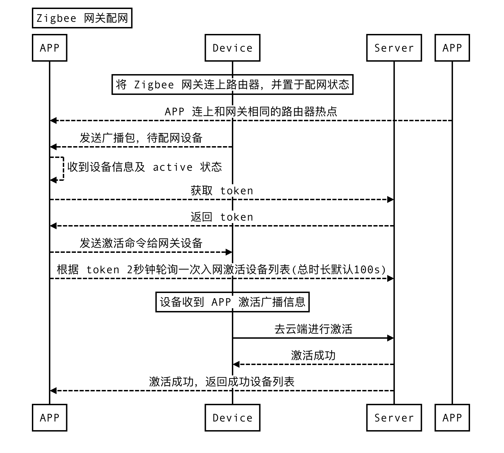
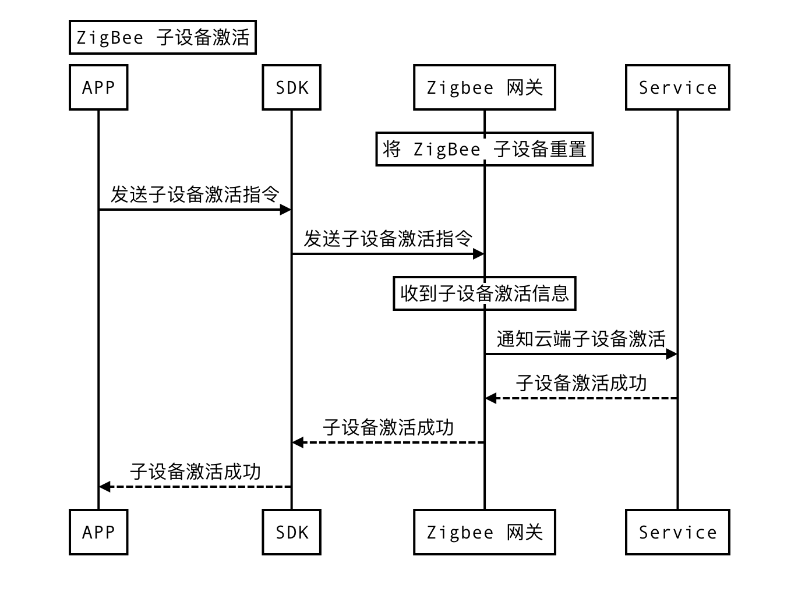

## 商照SDK配网模块

### 1.设备配网

#### 1.1 功能概述

设备配网 SDK 提供了把智能设备配置上路由器的能力，具体包括：

- 快连（EZ）模式

- 热点（AP）模式

- 摄像头二维码配网

- 有线设备配网

- 子设备配网

- 扫设备二维码配网

- 蓝牙设备配网


| 名词           | 解释                                                         |
| -------------- | ------------------------------------------------------------ |
| Wi-Fi 设备     | 采用 WiFi 模块连接路由器，和 APP 以及云端进行数据交互的智能设备。 |
| EZ 模式        | 又称快连模式，APP 把配网数据包打包到802.11数据包的指定区域中， 发送到周围环境；智能设备的 WiFi 模块处于混杂模式下， 监听捕获网络中的所有报文，按照约定的协议数据格式解析出 APP 发出配网信息包。 |
| AP 模式        | 又称热点模式，手机作为 STA 连接智能设备的热点，双方建立一个 Socket 连接通过约定端口交互数据。 |
| 摄像头扫码配网 | 摄像头设备通过扫描APP上的二维码获取配网数据信息              |
| 有线设备       | 通过有线网络连接路由器的设备，例如 ZigBee 有线网关、有线摄像头等 |
| 子设备         | 通过网关来跟 APP 以及云端数据交互的设备，例如 ZigBee 子设备  |
| ZigBee         | ZigBee 技术是一种近距离、低复杂度、低功耗、低速率、低成本的双向无线通讯技术。 主要用于距离短、功耗低且传输速率不高的各种电子设备之间进行数据传输以及典型的有周期性数据、间歇性数据和低反应时间数据传输的应用。 |
| ZigBee 网关    | 融合 ZigBee 网络中协调器和 WiFi 功能的设备，负责 ZigBee 网络的组建及数据信息存储。 |
| ZigBee 子设备  | ZigBee 网络中的路由或者终端设备，负责数据转发或者终端控制响应。 |

#### 1.2 使用须知

开发设备配网之前 需要先了解 TuyaCommercialLightingSdk 基本逻辑，并已经使用 TuyaCommercialLightingSdk 完成登录创建项目等基本操作。

#### 1.3 配网实现

##### 1.3.1 快连模式（EZ）


##### 初始化配网参数

```java
ActivatorBuilder builder = new ActivatorBuilder()
        .setSsid(ssid)
        .setContext(context)
        .setPassword(password)
        .setActivatorModel(ActivatorModelEnum.TY_EZ)
        .setTimeOut(timeout)
        .setToken(token)
        .setListener(new ITuyaSmartActivatorListener() {

                @Override
                public void onError(String errorCode, String errorMsg) {

                }

                @Override
                public void onActiveSuccess(DeviceBean devResp) {
                    //多个设备同时配网，将多次回调
                }

                @Override
                public void onStep(String step, Object data) {

                }
            }
        ));
```

**参数说明**

| 参数           | 说明                                              |
| -------------- | ------------------------------------------------- |
| token          | 配网所需要的激活 key                              |
| context        | 需要传入 activity 的 context                      |
| ssid           | 配网之后，设备工作WiFi的名称（家庭网络）          |
| password       | 配网之后，设备工作WiFi的密码（家庭网络）          |
| activatorModel | 配网模式，EZ 模式请传入：ActivatorModelEnum.TY_EZ |
| timeout        | 配网的超时时间设置，默认是 100s，单位是秒         |

**获取配网 token**

开始配网之前，SDK 需要在联网状态下从涂鸦云获取配网 Token，Token 的有效期为10分钟，且配置成功后就会失效（再次配网需要重新获取）。

```java
TuyaCommercialLightingSdk.getActivatorInstance().getActivatorToken(projectId,
        new ITuyaActivatorGetToken() {

            @Override
            public void onSuccess(String token) {

            }

            @Override
            public void onFailure(String s, String s1) {

            }
        });
```

**参数说明**

| 参数      | 说明                  |
| --------- | --------------------- |
| projectId | 项目 id，当前所属项目 |

##### 配网方法调用

```java
ITuyaActivator mTuyaActivator = TuyaCommercialLightingSdk.getActivatorInstance().newMultiActivator(builder);
//开始配网
mTuyaActivator.start();
//停止配网
mTuyaActivator.stop();
//退出页面销毁一些缓存和监听
mTuyaActivator.onDestroy();
```

**参数说明**

| 参数    | 说明             |
| ------- | ---------------- |
| builder | 初始化配网的参数 |


##### 1.3.2 热点配网（AP）


##### 初始化配网参数

```java
ActivatorBuilder builder = new ActivatorBuilder()
        .setContext(context)
        .setSsid(ssid)
        .setPassword(password)
        .setActivatorModel(ActivatorModelEnum.TY_AP)
        .setTimeOut(timeout)
        .setToken(token)
        .setListener(new ITuyaSmartActivatorListener() {

                @Override
                public void onError(String errorCode, String errorMsg) {

                }

                @Override
                public void onActiveSuccess(DeviceBean devResp) {

                }

                @Override
                public void onStep(String step, Object data) {

                }
            }
        ));
```

**参数说明**

| 参数           | 说明                                              |
| -------------- | ------------------------------------------------- |
| token          | 配网所需要的激活 key                              |
| context        | 需要传入 activity 的 context                      |
| ssid           | 配网之后，设备工作 Wi-Fi 的名称（家庭网络）       |
| password       | 配网之后，设备工作 Wi-Fi 的密码（家庭网络）       |
| activatorModel | 配网模式，AP 模式请传入：ActivatorModelEnum.TY_AP |
| timeout        | 配网的超时时间设置，默认是 100s ，单位是秒        |

**获取配网 token**

开始配网之前，SDK 需要在联网状态下从涂鸦云获取配网 Token，Token 的有效期为10分钟，且配置成功后就会失效（再次配网需要重新获取）。

```java
TuyaCommercialLightingSdk.getActivatorInstance().getActivatorToken(projectId,
        new ITuyaActivatorGetToken() {

            @Override
            public void onSuccess(String token) {

            }

            @Override
            public void onFailure(String s, String s1) {

            }
        });
```

**参数说明**

| 参数      | 说明    |
| --------- | ------- |
| projectId | 项目 id |

##### 配网方法调用

```java
ITuyaActivator mTuyaActivator = TuyaCommercialLightingSdk.getActivatorInstance().newActivator(builder);
//开始配网
mTuyaActivator.start();
//停止配网
mTuyaActivator.stop();
//退出页面销毁一些缓存和监听
mTuyaActivator.onDestroy();
```


##### 1.3.3. 摄像头二维码配网

##### 描述

通过摄像头设备扫描 APP 二维码来传递配网信息的方式来实现配网设备


##### 初始化配网参数

```java
TuyaCameraActivatorBuilder builder = new TuyaCameraActivatorBuilder()
         .setContext(context)
         .setSsid(ssid)
         .setPassword(password)
         .setToken(token)
         .setTimeOut(timeout)
         .setListener(new ITuyaSmartCameraActivatorListener() {
             @Override
             public void onQRCodeSuccess(String qrcodeUrl) {
                 //返回生成二维码的 url 链接
             }

             @Override
             public void onError(String errorCode, String errorMsg) {
                 //配网失败
             }

             @Override
             public void onActiveSuccess(DeviceBean devResp) {
                //配网成功
             }
         }));
```

**参数说明**

| 参数     | 说明                                        |
| -------- | ------------------------------------------- |
| token    | 配网所需要的激活 key                        |
| context  | 需要传入 activity 的 context                |
| ssid     | 配网之后，设备工作 Wi-Fi 的名称（家庭网络） |
| password | 配网之后，设备工作 Wi-Fi 的密码（家庭网络） |
| timeout  | 配网的超时时间设置，默认是 100s ，单位是秒  |

**获取配网 token**

开始配网之前，SDK 需要在联网状态下从涂鸦云获取配网 Token，Token 的有效期为10分钟，且配置成功后就会失效（再次配网需要重新获取）。

```java
TuyaCommercialLightingSdk.getActivatorInstance().getActivatorToken(projectId,
        new ITuyaActivatorGetToken() {

            @Override
            public void onSuccess(String token) {

            }

            @Override
            public void onFailure(String s, String s1) {

            }
        });
```

**参数说明**

| 参数      | 说明   |
| --------- | ------ |
| projectId | 项目id |

#### 配网方法调用

- 配网实现类

```java
ITuyaCameraDevActivator mTuyaActivator = TuyaCommercialLightingSdk.getActivatorInstance().newCameraDevActivator(builder);
```

- 获取二维码url链接

```java
mTuyaActivator.createQRCode(); //通过 onQRCodeSuccess 回调返回
```

- 根据url生成二维码

示例：需要依赖 zxing（ implementation 'com.google.zxing:core:3.2.1' ）

```java
public static Bitmap createQRCode(String url, int widthAndHeight)
            throws WriterException {
        Hashtable hints = new Hashtable();
        hints.put(EncodeHintType.CHARACTER_SET, "utf-8");
        hints.put(EncodeHintType.MARGIN,0);
        BitMatrix matrix = new MultiFormatWriter().encode(url,
                BarcodeFormat.QR_CODE, widthAndHeight, widthAndHeight, hints);

        int width = matrix.getWidth();
        int height = matrix.getHeight();
        int[] pixels = new int[width * height];

        for (int y = 0; y < height; y++) {
            for (int x = 0; x < width; x++) {
                if (matrix.get(x, y)) {
                    pixels[y * width + x] = BLACK;
                }
            }
        }
        Bitmap bitmap = Bitmap.createBitmap(width, height,
                Bitmap.Config.ARGB_8888);
        bitmap.setPixels(pixels, 0, width, 0, 0, width, height);
        return bitmap;
    }
```

- 开始配网

```java
mTuyaActivator.start();
```

- 停止配网

```java
mTuyaActivator.stop();
```

- 销毁数据

```java
mTuyaActivator.onDestory();
```


##### 1.3.4. 有线设备配网

##### 描述

有线设备是指通过有线网络连接路由器，配网过程不用输入路由器的热点名称和密码。下面以 ZigBee 有线网关介绍有线配网业务流程。




##### 发现设备

SDK 提供发现待配网有线设备的功能，获取设备前手机需与设备接入同一网络，然后注册获取有线设备的通知，待 SDK 收到有线设备的广播即会通过通知转发设备信息。

```java
ITuyaGwSearcher mTuyaGwSearcher = TuyaCommercialLightingSdk.getActivatorInstance().newTuyaGwActivator().newSearcher();
        mTuyaGwSearcher.registerGwSearchListener(new IGwSearchListener() {
            @Override
            public void onDevFind(HgwBean hgwBean) {

            }
        });
```

**参数说明**

| 参数    | 说明               |
| ------- | ------------------ |
| hgwBean | 发现的网关数据实体 |

##### 初始化配网参数

- 使用 SDK 的发现设备功能

```java
ITuyaActivator mITuyaActivator = TuyaCommercialLightingSdk.getActivatorInstance().newGwActivator(
        new TuyaGwActivatorBuilder()
            .setToken(token)
            .setTimeOut(timeout)
            .setContext(context)
            .setHgwBean(hgwBean)
            .setListener(new ITuyaSmartActivatorListener() {

                    @Override
                    public void onError(String errorCode, String errorMsg) {

                    }

                    @Override
                    public void onActiveSuccess(DeviceBean devResp) {

                    }

                    @Override
                    public void onStep(String step, Object data) {

                    }
            }
        ));
```

**参数说明**

| 参数    | 说明                                      |
| ------- | ----------------------------------------- |
| token   | 配网所需要的激活 key                      |
| timeout | 配网的超时时间设置，默认是100s ，单位是秒 |
| context | 需要传入 activity 的 context              |
| hgwBean | 监听发现的网关数据实体                    |


- 不使用 SDK 的发现设备功能

```java
ITuyaActivator mITuyaActivator = TuyaCommercialLightingSdk.getActivatorInstance().newGwActivator(
        new TuyaGwActivatorBuilder()
            .setToken(token)
            .setTimeOut(timeout)
            .setContext(context)
            .setListener(new ITuyaSmartActivatorListener() {

                    @Override
                    public void onError(String errorCode, String errorMsg) {

                    }

                    @Override
                    public void onActiveSuccess(DeviceBean devResp) {

                    }

                    @Override
                    public void onStep(String step, Object data) {

                    }
            }
        ));
```

**参数说明**

| 参数    | 说明                                      |
| ------- | ----------------------------------------- |
| token   | 配网所需要的激活 key                      |
| timeout | 配网的超时时间设置，默认是100s ，单位是秒 |
| context | 需要传入 activity 的 context              |


**获取配网 token**

开始配网之前，SDK 需要在联网状态下从涂鸦云获取配网 Token，Token 的有效期为10分钟，且配置成功后就会失效（再次配网需要重新获取）。

```java
TuyaCommercialLightingSdk.getActivatorInstance().getActivatorToken(projectId,
        new ITuyaActivatorGetToken() {

            @Override
            public void onSuccess(String token) {

            }

            @Override
            public void onFailure(String s, String s1) {

            }
        });
```

**参数说明**

| 参数      | 说明   |
| --------- | ------ |
| projectId | 项目Id |


#### 配网方法调用

```java
ITuyaActivator mITuyaActivator = TuyaCommercialLightingSdk.getActivatorInstance().newGwActivator(builder);
//开始配网
mITuyaActivator.start()
//停止配网
mITuyaActivator.stop()
//退出页面清理
mITuyaActivator.onDestroy()
```


##### 1.3.5. 子设备配网

##### 描述

子设备配网需要网关设备云在线的情况下才能发起,且子设备处于配网状态。下面以 ZigBee 网关子设备为例介绍配网业务流程。



#### 初始化配网参数

```java
TuyaGwSubDevActivatorBuilder builder = new TuyaGwSubDevActivatorBuilder()
        .setDevId(mDevId)
        .setTimeOut(timeout)
        .setListener(new ITuyaSmartActivatorListener() {

                @Override
                public void onError(String errorCode, String errorMsg) {

                }

                @Override
                public void onActiveSuccess(DeviceBean devResp) {

                }

                @Override
                public void onStep(String step, Object data) {

                }
            }
        ));
```

**参数说明**

| 参数    | 说明                                       |
| ------- | ------------------------------------------ |
| mDevId  | 设置网关 ID                                |
| timeout | 配网的超时时间设置，默认是 100s ，单位是秒 |

#### 配网方法调用

```java
ITuyaActivator mTuyaGWSubActivator = TuyaCommercialLightingSdk.getActivatorInstance().newGwSubDevActivator(builder);
//开始配网
mTuyaGWSubActivator.start();
//停止配网
mTuyaGWSubActivator.stop();
//销毁
mTuyaGWSubActivator.onDestory();
```


## 蓝牙配网系列

### 1.蓝牙BLE概述

涂鸦蓝牙有三条技术线路。蓝牙设备与手机一对一相连的蓝牙单点设备 **SingleBLE**，涂鸦自研的蓝牙拓扑通信 **TuyaMesh** 和蓝牙技术联盟发布的蓝牙拓扑通信 **SigMesh**。除了以上三种之外，还有一些多协议设备也会使用到蓝牙技术，比如同时具备 Wi-Fi 能力和 BLE 能力的 **双模设备**，也可以使用蓝牙进行配网，当然 Wi-Fi 设备原本的配网仍然可用。

| 蓝牙技术分类 | 产品举例                                                  |
| ------------ | --------------------------------------------------------- |
| SingleBLE    | 体脂秤、手环、温控器、电动牙刷、门锁等                    |
| SigMesh      | 一路、二路、五路等灯泡、插座、传感器等 Sigmesh 子设备     |
| TuyaMesh     | 与 Sigmesh 产品类似，协议为 Tuya 自研                     |
| 双模设备     | Sigmesh 网关、IPC 设备以及新版多协议 Wi-Fi 设备等均有可能 |

> 双模配网的蓝牙配网部分，使用的是 SingleBLE 技术为设备配网，将放到 SingleBLE 章节进行说明。

蓝牙部分所具备的功能如下：


**1.1 配网**

- 扫描发现设备
- 设备配网

**1.2 配网后的设备操作**

- 检查设备当前连接状态
- 连接设备
- 设备操作
- 解绑设备

**1.3 设备升级固件**

- 检测设备版本
- 升级设备固件 OTA


### 2 准备工作

**手机系统要求**

Android 4.4及以上系统版本

**Manifest 的权限**

```java
<uses-permission android:name="android.permission.ACCESS_COARSE_LOCATION" />
<uses-permission android:name="android.permission.ACCESS_FINE_LOCATION" />
<uses-permission android:name="android.permission.BLUETOOTH" />
<uses-permission android:name="android.permission.BLUETOOTH_ADMIN" />
```

**使用蓝牙前需要检测权限已被授予**

- APP 在使用蓝牙连接或者扫描操作前 需要检查 APP 定位权限是否被允许。

- 检查蓝牙状态是否为开启。

  > 该部分检查逻辑，TuyaCommercialLightingSdk 未提供 API，开发者可自行检测。每次扫描和连接前都要进行检测，否则 APP 无法正常使用蓝牙。


### 3 扫描设备

#### 3.1 开始扫描

待配网的蓝牙设备会向周围发送蓝牙广播包，SDK 会根据协议对广播包进行解析发现周围的涂鸦蓝牙单点设备和双模设备等。

> 再次提醒：蓝牙设备扫描前需要进行权限检测，只有**具备权限才能正常扫描** 1、蓝牙是否打开 2、应用是否具有定位权限

**接口说明**

```java
void startLeScan(int timeout, ScanType type, TyBleScanResponse response);
```

**参数说明**

| 参数     | 类型              | 说明                               |
| -------- | ----------------- | ---------------------------------- |
| timeout  | int               | 配网超时时间，单位 ms ，推荐 60s   |
| type     | ScanType          | `ScanType.SINGLE` 表示扫描单点设备 |
| response | TyBleScanResponse | 扫描结果的回调，不能为空           |

**示例代码**

```java
TuyaCommercialLightingSdk.getBleOperator().startLeScan(60000, ScanType.SINGLE, new  TyBleScanResponse() {
   @Override
   public void onResult(ScanDeviceBean bean) {

   }
});
```

**回调说明**

`ScanDeviceBean` 说明

| 属性         | 类型    | 说明                                                         |
| ------------ | ------- | ------------------------------------------------------------ |
| id           | String  | 扫描 id 通常由 uuid 组成，可以唯一区别设备                   |
| name         | String  | 扫描到的蓝牙名称 一般为空                                    |
| providerName | String  | SingleBleProvider 只开发单点设备不需要关注该字段             |
| data         | byte[]  | 原始数据                                                     |
| configType   | String  | `config_type_single`：单点设备;`config_type_wifi`：双模设备  |
| productId    | String  | 产品 id                                                      |
| uuid         | String  | 产品 uuid，设备唯一码                                        |
| mac          | String  | 设备 mac，不可作为唯一码                                     |
| isbind       | boolean | 是否被绑定，能回调的均为未配网的设备                         |
| flag         | int     | `bit0` ：是否支持 5G，表明双模设备是否支持 5G Wi-Fi；`bit1`：是否后绑定 |


#### 3.2 停止扫描

停止扫描设备，比如退出配网页面 或者 在执行设备入网时，建议停止扫描，以防止扫描影响到配网过程。

**接口说明**

```java
void stopLeScan();
```

**代码示例**

```java
TuyaCommercialLightingSdk.getBleOperator().stopLeScan();
```


### 4. 配网


#### 4.1 单点设备配网

##### 4.1.1 单点设备入网

扫描到的设备 `configType=config_type_single` 表示单点蓝牙设备。`config_type_wifi`为双模设备。

**接口说明**

```java
void startBleConfig(long projectId, String devUuid, Map<String, Object> params, ITuyaBleConfigListener configListener);
```

**参数说明**

| 参数           | 类型                   | 说明                                          |
| -------------- | ---------------------- | --------------------------------------------- |
| projectId      | long                   | 当前项目Id                                    |
| devUuid        | String                 | 扫描到的设备中 uuid。即 `ScanDeviceBean.uuid` |
| params         | Map                    | 传 null，单点配网不需要该参数                 |
| configListener | ITuyaBleConfigListener | 配网回调，不可为空                            |


**代码示例**

```java
TuyaCommercialLightingSdk.getBleManager().startBleConfig(projectId, uuid, null, new ITuyaBleConfigListener() {
   @Override
   public void onSuccess(DeviceBean bean) {
      // 回调的 DeviceBean 数据说明 与WIFI的设备配网一致参见WiFI设备的配网回调说明。
   }

   @Override
   public void onFail(String code, String msg, Object handle) {
      // code msg 说明 见本章节配网错误码
   }
});
```

##### 4.1.2 取消单点设备入网

配网过程中终止配网。

**接口说明**

```java
void stopBleConfig(String devUuid);
```

**参数说明**

| 参数    | 类型   | 说明                                         |
| ------- | ------ | -------------------------------------------- |
| devUuid | String | 扫描到的设备中 uuid，即`ScanDeviceBean.uuid` |

**示例代码**

```java
TuyaCommercialLightingSdk.getBleManager().stopBleConfig(uuid);
```


#### 4.2 双模设备配网

##### 4.2.1 双模设备入网

双模设备扫描到后 可以进行入网激活 扫描到的设备 `configType=config_type_single`表示单点蓝牙设备。`config_type_wifi`为双模设备。

**接口说明**

```java
void startBleConfig(long projectId, String devUuid, Map<String, Object> params, ITuyaBleConfigListener configListener);
```

**参数说明**

| 参数           | 类型                   | 说明                                          |
| -------------- | ---------------------- | --------------------------------------------- |
| projectId      | long                   | 当前项目projectId                             |
| devUuid        | String                 | 扫描到的设备中 uuid，即 `ScanDeviceBean.uuid` |
| params         | Map                    | 双模设备需要传网络信息 ssid、pwd、token信息   |
| configListener | ITuyaBleConfigListener | 配网回调，不可为空                            |

> 若未说明，一般设备只支持 2.4G 频段WIFI配网，部分设备支持 5G。可以根据 `ScanDeviceBean.flag` 进行判定。 token: 获取 token 的方式与 Wi-Fi 设备配网一致，见 Wi-Fi 部分配网获取 Token

**代码示例**

```java
Map<String, Object> param = new HashMap<>();
param.put("ssid", "Tuya-Wifi-2.4G"); //wifi ssid
param.put("password", "12345678"); //wifi pwd
param.put("token", "xxxxxxxxxxxxx"); // user token
TuyaCommercialLightingSdk.getBleManager().startBleConfig(projectId, uuid, param, new ITuyaBleConfigListener() {
    @Override
    public void onSuccess(DeviceBean bean) {
        // 回调的 DeviceBean 数据说明 参见WiFI设备的配网回调。
    }

    @Override
    public void onFail(String code, String msg, Object handle) {
        // code msg 说明 见本章节配网错误码
    }
});
```


##### 4.2.2 取消双模设备配网

配网中终止配网。

**接口说明**

```java
void stopBleConfig(String devUuid);
```

**参数说明**

| 参数    | 类型   | 说明                |
| ------- | ------ | ------------------- |
| devUuid | String | 扫描到的设备中 uuid |

**示例代码**

```java
TuyaCommercialLightingSdk.getBleManager().stopBleConfig(uuid);
```


### 5. 蓝牙设备连接

#### 5.1 连接设备

若设备处于离线状态 可以调用连接方法 进行设备连接。【注意】连接方法需要在主线程中调用

**接口说明**

```java
void addScanLinkTaskIds(String idJsonString);
```

**参数说明**

| 参数         | 类型   | 说明       |
| ------------ | ------ | ---------- |
| idJsonString | String | devId 集合 |

**示例代码**

```java
 List<String> devIdList = new ArrayList<>();
 devIdList.add(devId1); //设备1 devId
 devIdList.add(devId2); //设备2 devId

 String ids = JSONObject.toJSONString(devIdList);
 TuyaCommercialLightingSdk.getBleManager().addScanLinkTaskIds(ids);
```


#### 5.2 断开连接

可主动断开已连接的设备。【注意】断开方法需要在主线程中调用

**接口说明**

```java
void disconnectLinkedIds(String idJsonString);
```

**参数说明**

| 参数         | 类型   | 说明       |
| ------------ | ------ | ---------- |
| idJsonString | String | devId 集合 |

**示例代码**

```java
 List<String> devIdList = new ArrayList<>();
 devIdList.add(devId1); //设备1 devId
 devIdList.add(devId2); //设备2 devId

 String ids = JSONObject.toJSONString(devIdList);
 TuyaCommercialLightingSdk.getBleManager().disconnectLinkedIds(ids);
```


### 6. 错误码

| 错误码 | 说明                     |
| ------ | ------------------------ |
| 1      | 设备接收的数据包格式错误 |
| 2      | 设备找不到路由器         |
| 3      | Wi-Fi 密码错误           |
| 4      | 设备连不上路由器         |
| 5      | 设备 DHCP 失败           |
| 6      | 设备连云失败             |
| 100    | 用户取消配网             |
| 101    | 蓝牙连接错误             |
| 102    | 发现蓝牙服务错误         |
| 103    | 打开蓝牙通讯通道失败     |
| 104    | 蓝牙获取设备信息失败     |
| 105    | 蓝牙配对失败             |
| 106    | 配网超时                 |
| 107    | Wi-Fi 信息发送失败       |
| 108    | Token 失效               |
| 109    | 获取蓝牙加密密钥失败     |
| 110    | 设备不存在               |
| 111    | 设备云端注册失败         |
| 112    | 设备云端激活失败         |
| 113    | 云端设备已被绑定         |
| 114    | 主动断开                 |
| 115    | 云端获取设备信息失败     |
| 116    | 设备此时正被其他方式配网 |
| 117    | OTA 升级失败             |
| 118    | OTA 升级超时             |
| 119    | Wi-Fi 配网传参校验失败   |


### （2）蓝牙Mesh(SIG)

涂鸦蓝牙有三条技术线路。蓝牙设备与手机一对一相连的蓝牙单点设备 **SingleBLE**，涂鸦自研的蓝牙拓扑通信 **TuyaMesh** 和蓝牙技术联盟发布的蓝牙拓扑通信 **SigMesh**。除了以上三种之外，还有一些多协议设备也会使用到蓝牙技术，比如同时具备 Wi-Fi 能力和 BLE 能力的 **双模设备**，也可以使用蓝牙进行配网，当然 Wi-Fi 设备原本的配网仍然可用。

| 蓝牙技术分类 | 产品举例                                                  |
| ------------ | --------------------------------------------------------- |
| SingleBLE    | 体脂秤、手环、温控器、电动牙刷、门锁等                    |
| SigMesh      | 一路、二路、五路等灯泡、插座、传感器等 Sigmesh 子设备     |
| TuyaMesh     | 与 Sigmesh 产品类似，协议为 Tuya 自研                     |
| 双模设备     | Sigmesh 网关、IPC 设备以及新版多协议 Wi-Fi 设备等均有可能 |

#### 提示

开发蓝牙 Mesh 时，请先熟悉 TuyaCommercialLightingSdk。Mesh 的所有操作都建立在项目数据已经初始化的基础上。 一个项目里可以拥有多个 Mesh（建议一个项目只创建一个，方便管理）

#### 1.1. 准备

**手机系统要求**

Android 4.4及以上系统版本

**Manifest 的权限**

```java
<uses-permission android:name="android.permission.ACCESS_COARSE_LOCATION" />
<uses-permission android:name="android.permission.ACCESS_FINE_LOCATION" />
<uses-permission android:name="android.permission.BLUETOOTH" />
<uses-permission android:name="android.permission.BLUETOOTH_ADMIN" />
```

**使用蓝牙前需要检测权限已被授予**

- APP 在使用蓝牙连接或者扫描操作前 需要检查 APP 定位权限是否被允许。
- 检查蓝牙状态是否为开启。

> 该部分检查逻辑，TuyaCommercialLightingSdk 未提供 API，开发者可自行检测。每次扫描和连接前都要进行检测，否则 APP 无法正常使用蓝牙。


#### 1.2. 部分基础概念

#### 大小类介绍

设备类别值由 设备类型 + 大类 + 小类组成后小端排列。

#### 设备类型

```java
标准型 Tuya 设备 : 1
透传型 Tuya 设备 : 2
......
```

#### SigMesh 产品目前分为三大类

```java
灯大类(01): 1-5 路 RGBWC 彩灯
电工类(02): 1-6 路插座
遥控器(05): 1-6 个按键
```

#### 小类编号

```java
1-5路灯（1-5）
1-6路排插（1-6)
1-6个遥控器按键（1-6）
.....
```

#### 举例

| 产品         | 类别值 | 说明                                                  |
| ------------ | ------ | ----------------------------------------------------- |
| 标准五路灯   | 1510   | 小端转换后得到 1015： 1：tuya设备 01：灯 5：5路灯     |
| 标准四路插座 | 2410   | 小端转换后得到 1024： 1：tuya设备 02：插座 5：4路插座 |
| 透传型设备   | xx20   | 小端转换后得到 20xx： 2：透传设备                     |


#### Mesh 节点 NodeId， 2 字节

NodeId 用于区分每个 Mesh 设备在 Mesh 网中的「唯一标识」，比如想控制某个设备就向 Mesh 网发此设备对应的 NodeId 命令即可。

#### Mesh 群组 localId，2 字节

LocalId 用于区分每个 Mesh 群组在 Mesh 网中的「唯一标识」，比如想控制某个群组中的设备就向 Mesh 网发此群组对应的 LocalId 命令即可。

#### 设备操作需要多步操作

因为设备的操作，例如增删操作、群组操作，都需要本地蓝牙命令执行一次、云端记录一次 向本地 Mesh 网同步操作信息的同时也需要向云端同步操作信息。

#### 本地连接和网关连接

本地连接：已配网设备通过蓝牙连接，来控制 Mesh 和指令操作。

网关连接：已配网设备通过网关连接（网关需和设备在一起，距离不能太远），来控制 Mesh 和指令操作。


#### 1.3. 管理

### 1.3.1. 创建 SIG Mesh

由云端分配 MeshId，一个项目下只能创建一个 Mesh。

**接口方法**

```java
void createSigMesh(long projectId,ISigMeshCreateCallback callback);
```

**示例代码**

```java
TuyaCommercialLightingSdk.getSigMeshInstance().createSigMesh(projectId, new ISigMeshCreateCallback() {
            @Override
            public void onError(String errorCode, String errorMsg) {

            }

            @Override
            public void onSuccess(SigMeshBean sigMeshBean) {

            }
        });
```

### 1.3.2. 删除 SIG Mesh

删除 SIG Mesh MeshId

**接口方法**

```java
void removeMesh(IResultCallback callback);
```

**示例代码**

```java
TuyaCommercialLightingSdk.newSigMeshDeviceInstance(meshId).removeMesh(new IResultCallback() {
    @Override
    public void onError(String errorCode, String errorMsg) {
    }

    @Override
    public void onSuccess() {
    }
});
```


### 1.3.3. 获取家庭下的 SIG Mesh 列表

**接口说明**

```java
List<SigMeshBean> getSigMeshList();
```

**示例代码**

```java
List<SigMeshBean> meshList = TuyaCommercialLightingSdk.getSigMeshInstance().getSigMeshList()
```

### 1.3.4. 获取 Mesh 下的子设备列表

**接口说明**

```java
List<DeviceBean> getMeshSubDevList();
```

**示例代码**

```java
List<DeviceBean> meshSubDevList = TuyaCommercialLightingSdk.newSigMeshDeviceInstance(meshId).getMeshSubDevList()
```

### 1.3.5. 获取 SIG Mesh 实例

建议在项目切换的时候 销毁当前 Mesh 然后重新初始化项目中的 Mesh。

**接口说明**

```java
void initMesh(String meshId);
```

**示例代码**

```java
TuyaCommercialLightingSdk.getTuyaSigMeshClient().initMesh(meshId);
```

### 1.3.6. SIG Mesh 销毁

**接口说明**

```java
void destroyMesh(String meshId);
```

**示例代码**

```java
 TuyaCommercialLightingSdk.getTuyaSigMeshClient().destroyMesh(meshId);
```

### 1.3.7. SIG Mesh 子设备连接和断开

`ITuyaBlueMeshClient` 提供 开始连接、断开连接、开启扫描、停止扫描

**代码示例**

```java
// 开启连接
TuyaCommercialLightingSdk.getTuyaSigMeshClient().startClient(mSigMeshBean);
// 开启连接 指定扫描的时间
TuyaCommercialLightingSdk.getTuyaSigMeshClient().startClient(mSigMeshBean,searchTime);

//断开连接
TuyaCommercialLightingSdk.getTuyaSigMeshClient().stopClient();

//开启扫描
TuyaCommercialLightingSdk.getTuyaSigMeshClient().startSearch()

//停止扫描
TuyaCommercialLightingSdk.getTuyaSigMeshClient().stopSearch();
```

**注意事项**

- `startClient(mSigMeshBean)` 开启连接后，会在后台不断的去扫描周围可连接设备，直到连接成功为止。
- `startClient(mSigMeshBean,searchTime)` 开启连接后， `searchTime` 时间内没有扫描到设备就停止扫描.
- 后台一直扫描会消耗资源，可以通过通过开启扫描和停止扫描来控制后台的扫描
- 当未 `startClient()` 时候，调用 `startSearch()` 和 `stopSearch()` 是没有效果的
- 当已经连接到 Mesh 网的时候，调用 `startSearch` 和 `stopSearch` 是没有效果的


#### 1.4. 配网

### 1.4.1. 扫描待配网子设备

扫描前需要检查蓝牙和位置权限 ;扫描附近符合 SIG 标准的蓝牙设备

**接口说明**

```java
//开启扫描
void startSearch();
//停止扫描
void stopSearch();
```

**示例代码**

```java
ITuyaBlueMeshSearchListener iTuyaBlueMeshSearchListener=new ITuyaBlueMeshSearchListener() {
    @Override
    public void onSearched(SearchDeviceBean deviceBean) {

    }

    @Override
    public void onSearchFinish() {

    }
};
// 待配网的SigMesh设备UUID是固定的
UUID[] MESH_PROVISIONING_UUID = {UUID.fromString("00001827-0000-1000-8000-00805f9b34fb")};
SearchBuilder searchBuilder = new SearchBuilder()
                                .setServiceUUIDs(MESH_PROVISIONING_UUID)    //SigMesh的UUID是固定值
                .setTimeOut(100)        //扫描时长 单位秒
                .setTuyaBlueMeshSearchListener(iTuyaBlueMeshSearchListener).build();

ITuyaBlueMeshSearch mMeshSearch = TuyaCommercialLightingSdk.getTuyaBlueMeshConfig().newTuyaBlueMeshSearch(searchBuilder);

//开启扫描
mMeshSearch.startSearch();

//停止扫描
mMeshSearch.stopSearch();
```


### 1.4.2. SIG Mesh 子设备蓝牙配网

子设备入网有两种方式，一种是通过 App 蓝牙入网，另一种是通过网关直接配子设备入网。

**接口说明**

```java
//开启配网
void startActivator();
//停止配网
void stopActivator();
```

**示例代码**

```java
TuyaSigMeshActivatorBuilder tuyaSigMeshActivatorBuilder = new TuyaSigMeshActivatorBuilder()
            .setSearchDeviceBeans(mSearchDeviceBeanList)
            .setSigMeshBean(sigMeshBean) // Sigmesh基本信息
            .setTimeOut(timeout)  //超时时间
            .setTuyaBlueMeshActivatorListener(new ITuyaBlueMeshActivatorListener() {
                   @Override
                   public void onSuccess(String mac, DeviceBean deviceBean) {
                       L.d(TAG, "subDevBean onSuccess: " + deviceBean.getName());
                   }
                   @Override
                   public void onError(String mac, String errorCode, String errorMsg) {
                       L.d(TAG, "config mesh error" + errorCode + " " + errorMsg);
                   }
                   @Override
                   public void onFinish() {
                    L.d(TAG, "config mesh onFinish： ");
                   }
              );

ITuyaBlueMeshActivator iTuyaBlueMeshActivator = TuyaCommercialLightingSdk
  .getTuyaBlueMeshConfig().newSigActivator(tuyaSigMeshActivatorBuilder);

//开启配网
iTuyaBlueMeshActivator.startActivator();
//停止配网
iTuyaBlueMeshActivator.stopActivator();
```

**入参说明**

| 参数                  | 说明                                                         |
| --------------------- | ------------------------------------------------------------ |
| mSearchDeviceBeanList | 待配网的设备集合,通过 startSearch 扫描得到的                 |
| timeout               | 配网的超时时间设置，默认是 100s（配网设备过多时，需要增加时间) |
| sigMeshBean           | SigMeshBean                                                  |

### 1.4.3. SIG Mesh 网关配网

SigMesh 网关 本质上为双模设备；

可以使用 Wi-Fi设备的配网 ；

也可以使用单点蓝牙双模配网;

### 1.4.4. SIG Mesh 子设备网关配网

SIG Mesh 子设备可以通过网关直接给子设备配网，配网的方式与 Zigbee 子设备入网方法一致；

### 1.4.5. 配网错误码

| Code   | MSG                    |
| ------ | ---------------------- |
| 21002  | invite 失败            |
| 21004  | provision 失败         |
| 21006  | send public key 失败   |
| 21008  | conform 失败           |
| 210010 | random conform 失败    |
| 210014 | send data 失败         |
| 210016 | composition data 失败  |
| 210018 | add appkey 失败        |
| 210020 | bind model 失败        |
| 210022 | publication model 失败 |
| 210024 | network transmit 失败  |
| 210026 | 云端注册失败           |
| 210027 | 设备地址分配已满       |
| 210034 | notify 失败            |
| 20021  | 配网超时               |
